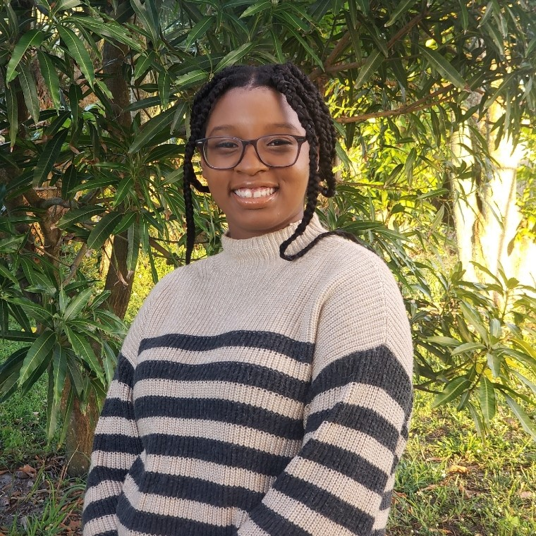

## Hello! 👋
### Computer Science Junior at Boston University | Break Through Tech AI @ MIT Fellow | Media Assistant at Boston University's Makechnie Study Center

I am pursuing a Bachelor’s of Art and Master's of Science in Computer Science at Boston University. My expected graduation is May 2026.
I have completed a wide range of Computer Science courses and programs, and, as a result, have a strong grasp in Data Structures, Algorithms, C++, and GDB. 
I am always looking for opportunities to expand my knowledge in Computer Science, especially in Artificial Intelligence, Physical Computing, Cybersecurity, and Gaming. I am excited to continue to grow my career and learn all that I can!
<!-- Photo here -->
  

### Currently Learning
1. AI/ML
2. Cybersecurity
3. Cryptography
### Currently Working On
1. Reading level for any book website
2. Basic goodreads website
3. Leetcode

### How to Reach Me
1. LinkedIn: https://www.linkedin.com/in/sarah-cadet-8052b7267/
2. Email: scadet@bu.edu

<!--
**SarahCadet/SarahCadet** is a ✨ _special_ ✨ repository because its `README.md` (this file) appears on your GitHub profile.

Here are some ideas to get you started:

- 🔭 I’m currently working on ...
- 🌱 I’m currently learning ...
- 👯 I’m looking to collaborate on ...
- 🤔 I’m looking for help with ...
- 💬 Ask me about ...
- 📫 How to reach me: ...
- 😄 Pronouns: ...
- ⚡ Fun fact: ...
-->
